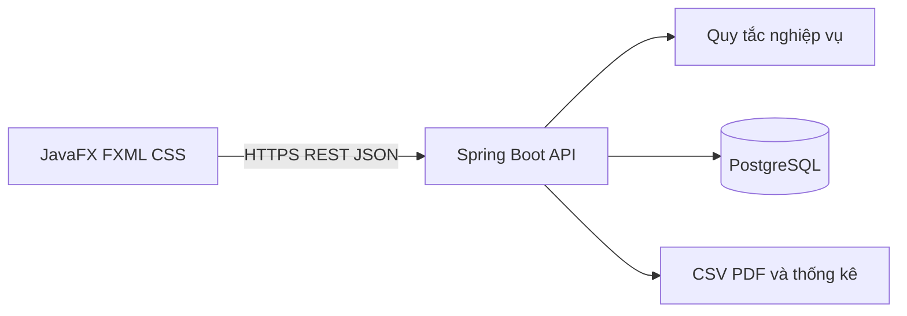

# Kiến trúc bản đầu

## Quy ước

- Đơn vị: VND nguyên đồng; lưu `BIGINT`/`long`. Không nhận phần lẻ, không làm tròn ngầm. CSV có phần thập phân khác 0 sẽ bị từ chối; giá trị `.00` được chấp nhận sau khi kiểm tra chính xác.
- Thời gian lưu UTC (`timestamptz`), hiển thị theo múi giờ máy người dùng.
- Một tài khoản có một ví. Mã ví là chuỗi công khai, sinh ở server và bất biến. Email đăng nhập là duy nhất sau chuẩn hóa chữ thường.
- Đăng ký luôn tạo role `USER` và ví có số dư 0. Tài khoản `ADMIN` được cấp qua quy trình cấu hình/seed an toàn riêng, không qua API đăng ký.
- Mật khẩu băm bằng BCrypt hoặc Argon2id; phiên xác thực qua token ngắn hạn. Chỉ hash của token lưu ở `auth_sessions` để có thể thu hồi khi đăng xuất. Token thô chỉ ở bộ nhớ desktop, không ghi log hoặc lưu vào Git.

## Thành phần

JavaFX không chứa thông tin kết nối PostgreSQL. Server kiểm tra quyền trên mọi request; dữ liệu ví và giao dịch luôn lấy từ server.

## Chuyển tiền

1. UI tra cứu mã ví, hiển thị tên rút gọn và mã ví, nhập số VND nguyên đồng.
2. UI hiển thị màn hình xác nhận. Khi người dùng xác nhận, UI sinh một UUID `requestKey`; nếu retry do timeout thì giữ nguyên UUID.
3. Server xác thực người gửi, bắt đầu transaction PostgreSQL và lấy `pg_advisory_xact_lock` theo `(sender_wallet_id, request_key)`. Khóa này bao phủ cả khoảng thời gian trước `INSERT`, khi unique constraint chưa nhìn thấy giao dịch của request khác.
4. Sau khi lấy khóa, nếu đã có giao dịch cùng khóa, so sánh mã người nhận và số tiền: trùng khớp trả biên nhận cũ, khác nội dung trả `409`. Unique constraint `(sender_wallet_id, request_key)` vẫn là lớp bảo vệ cuối ở database.
5. Khóa hai dòng ví theo UUID tăng dần (`SELECT ... FOR UPDATE`) để tránh deadlock, rồi kiểm tra số tiền dương, khác ví và đủ số dư.
6. Cập nhật hai số dư, ghi `transfers` và hai `ledger_entries` trong cùng transaction; commit xong mới trả biên nhận. Mọi lỗi rollback tất cả.

`TransferRules` giữ quy tắc thuần từ mốc 1. `TransferService` bao giao dịch bằng `@Transactional`, lấy advisory lock và khóa dòng ví theo thứ tự UUID. `WalletApiIT` kiểm tra thật trên PostgreSQL, gồm cạnh tranh số dư, request trùng và rollback sau lỗi giả lập.

## Dữ liệu và ranh giới

`wallets.balance_dong` là số dư hiện tại; `ledger_entries` là dấu vết biến động. `transfers` có một dòng mỗi lần chuyển và hai bút toán đối ứng. `admin_grants` ghi người cấp, lý do, số tiền và bút toán tăng ví. `imported_expenses` chỉ liên kết `import_batches`, không có `wallet_id` và không được gọi service cập nhật ví.

## Giao diện dự kiến

Phong cách tối giản cho ứng dụng tài chính: nền xanh đen `#020617`, thẻ `#0E1223`, chữ `#F8FAFC`, nút chính xanh `#22C55E`. Màn hình đăng nhập/đăng ký, dashboard, chuyển tiền (tra cứu → nhập → xác nhận → biên nhận), lịch sử, sao kê, nhập CSV/thống kê, và quản trị. Tất cả lỗi có thông điệp tiếng Việt gắn với thao tác; nút xác nhận chỉ bật khi dữ liệu hợp lệ; điều hướng và focus dùng được với bàn phím.
