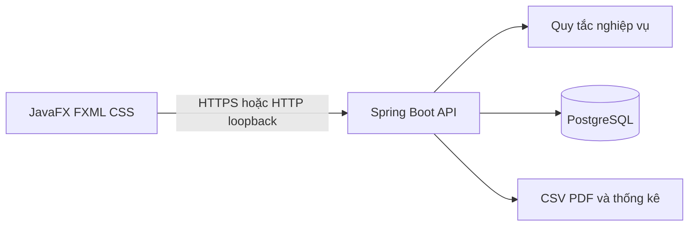

# Kiến trúc bản đầu

## Quy ước

- Đơn vị: VND nguyên đồng; lưu `BIGINT`/`long`. Không nhận phần lẻ, không làm tròn ngầm. CSV có phần thập phân khác 0 sẽ bị từ chối; giá trị `.00` được chấp nhận sau khi kiểm tra chính xác.
- Thời gian lưu UTC (`timestamptz`), hiển thị theo múi giờ máy người dùng.
- Một tài khoản có một ví. Mã ví là chuỗi công khai, sinh ở server và bất biến. Email đăng nhập là duy nhất sau chuẩn hóa chữ thường.
- Đăng ký luôn tạo role `USER` và ví có số dư 0. Tài khoản `ADMIN` được cấp qua quy trình cấu hình/seed an toàn riêng, không qua API đăng ký.
- Mật khẩu băm bằng BCrypt hoặc Argon2id; phiên xác thực qua token ngắn hạn. Chỉ hash của token lưu ở `auth_sessions` để có thể thu hồi khi đăng xuất. Token thô chỉ ở bộ nhớ desktop, không ghi log hoặc lưu vào Git.

## Thành phần

JavaFX không chứa thông tin kết nối PostgreSQL. Server kiểm tra quyền trên mọi request; dữ liệu ví và giao dịch luôn lấy từ server.

## Chuyển tiền

1. UI tra cứu mã ví, hiển thị tên rút gọn và mã ví, nhập số VND nguyên đồng.
2. UI hiển thị màn hình xác nhận. Khi người dùng xác nhận, UI sinh một UUID `requestKey`; nếu retry do timeout thì giữ nguyên UUID.
3. Server xác thực người gửi, bắt đầu transaction PostgreSQL và lấy `pg_advisory_xact_lock` theo `(sender_wallet_id, request_key)`. Khóa này bao phủ cả khoảng thời gian trước `INSERT`, khi unique constraint chưa nhìn thấy giao dịch của request khác.
4. Sau khi lấy khóa, nếu đã có giao dịch cùng khóa, so sánh mã người nhận và số tiền: trùng khớp trả biên nhận cũ, khác nội dung trả `409`. Unique constraint `(sender_wallet_id, request_key)` vẫn là lớp bảo vệ cuối ở database.
5. Khóa hai dòng ví theo UUID tăng dần (`SELECT ... FOR UPDATE`) để tránh deadlock, rồi kiểm tra số tiền dương, khác ví và đủ số dư.
6. Cập nhật hai số dư, ghi `transfers` và hai `ledger_entries` trong cùng transaction; commit xong mới trả biên nhận. Mọi lỗi rollback tất cả.

`TransferRules` giữ quy tắc thuần từ mốc 1. `TransferService` bao giao dịch bằng `@Transactional`, lấy advisory lock và khóa dòng ví theo thứ tự UUID. `WalletApiIT` kiểm tra thật trên PostgreSQL, gồm cạnh tranh số dư, request trùng và rollback sau lỗi giả lập.

ADMIN có thể gọi `GET /api/v1/admin/reconciliation` để đối chiếu số dư lưu ở `wallets` với tổng bút toán `ledger_entries` theo một snapshot chỉ đọc. API trả số ví đã kiểm tra, số ví sai lệch và danh sách sai lệch phân trang; không tự sửa dữ liệu. Ba giá trị tiền của mỗi sai lệch được trả dạng chuỗi để giữ chính xác cả khi tổng bút toán vượt phạm vi `long`.

## Dữ liệu và ranh giới

`wallets.balance_dong` là số dư hiện tại; `ledger_entries` là dấu vết biến động. `transfers` có một dòng mỗi lần chuyển và hai bút toán đối ứng. `admin_grants` ghi người cấp, `request_key`, lý do, số tiền và bút toán tăng ví. `GrantService` khóa theo `(admin_user_id, request_key)` trước khi đọc/ghi, còn unique constraint bảo vệ ở database; cùng khóa và nội dung trả lại biên nhận cũ. `imported_expenses` chỉ liên kết `import_batches`, không có `wallet_id` và không được gọi service cập nhật ví.

## Giao diện desktop mốc 4

Module Maven `desktop/` chỉ phụ thuộc JavaFX, Jackson và HTTP client của JDK. `login.fxml` và `workspace.fxml` định nghĩa bố cục; `wallet.css` đặt màu, kiểu chữ và trạng thái điều khiển. `WalletApiClient` gọi REST bất đồng bộ, không có JDBC hoặc thông tin PostgreSQL. `LoginController` giữ token trong client tại bộ nhớ rồi chuyển client đó cho `WorkspaceController`; đăng xuất gọi server và xóa token.

Giao diện nền xanh đen, thẻ xanh navy, chữ sáng và nút chính xanh lá. Các trang gồm đăng nhập/đăng ký, tổng quan, chuyển tiền, lịch sử/biên nhận, sao kê, nhập CSV, thống kê và cấp tiền ADMIN. `WorkspaceController` giữ `TransferIntent(requestKey, recipientCode, amountDong)` sau khi người dùng xác nhận; nếu timeout hoặc HTTP 5xx, nút thử lại gửi đúng payload này. Chỉ kết quả chắc chắn mới xóa intent. Sau chuyển tiền thành công, giao diện tải lại ví và lịch sử từ server. Cấp tiền ADMIN dùng `GrantIntent(requestKey, recipientCode, amountDong, reason)` với cùng nguyên tắc retry, không tự gửi lại; bảng `admin_grants` ràng buộc unique theo `(admin_user_id, request_key)`.
