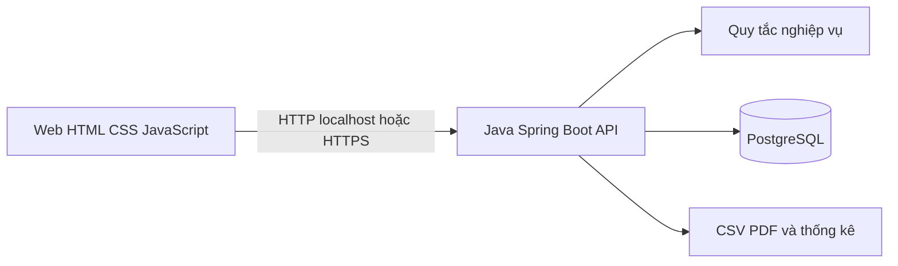

# Kiến trúc bản đầu

## Quy ước

- Đơn vị: VND nguyên đồng; lưu `BIGINT`/`long`. Không nhận phần lẻ, không làm tròn ngầm. CSV có phần thập phân khác 0 sẽ bị từ chối; giá trị `.00` được chấp nhận sau khi kiểm tra chính xác.
- Thời gian lưu UTC (`timestamptz`), hiển thị theo múi giờ máy người dùng.
- Một người dùng có một tài khoản Thanh toán mặc định và có thể mở thêm tài khoản. Mỗi tài khoản có mã công khai riêng, sinh ở server và bất biến. Email đăng nhập là duy nhất sau chuẩn hóa chữ thường.
- Đăng ký luôn tạo role `USER` và tài khoản Thanh toán mặc định có số dư 0. Tài khoản `ADMIN` được cấp qua quy trình cấu hình/seed an toàn riêng, không qua API đăng ký.
- Mật khẩu băm bằng BCrypt; phiên xác thực qua token ngắn hạn. Chỉ hash của token lưu ở `auth_sessions` để có thể thu hồi khi đăng xuất. Token thô chỉ ở bộ nhớ của tab web, không ghi log hoặc lưu vào Git.

## Thành phần

Giao diện web không chứa thông tin kết nối PostgreSQL. Server kiểm tra quyền trên mọi request; dữ liệu ví và giao dịch luôn lấy từ server.

## Chuyển tiền

1. UI tra cứu mã ví, hiển thị tên rút gọn và mã ví, nhập số VND nguyên đồng.
2. UI hiển thị màn hình xác nhận. Khi người dùng xác nhận, UI sinh một UUID `requestKey`; nếu retry do timeout thì giữ nguyên UUID.
3. Server xác thực người gửi, bắt đầu transaction PostgreSQL và lấy `pg_advisory_xact_lock` theo `(sender_wallet_id, request_key)`. Khóa này bao phủ cả khoảng thời gian trước `INSERT`, khi unique constraint chưa nhìn thấy giao dịch của request khác.
4. Sau khi lấy khóa, nếu đã có giao dịch cùng khóa, so sánh mã người nhận và số tiền: trùng khớp trả biên nhận cũ, khác nội dung trả `409`. Unique constraint `(sender_wallet_id, request_key)` vẫn là lớp bảo vệ cuối ở database.
5. `AccountPolicy` kiểm tra loại tài khoản nguồn/đích có được chuyển tiền hay không. Khóa hai dòng ví theo UUID tăng dần (`SELECT ... FOR UPDATE`) để tránh deadlock, rồi kiểm tra số tiền dương, khác ví và đủ số dư.
6. Cập nhật hai số dư, ghi `transfers` và hai `ledger_entries` trong cùng transaction; commit xong mới trả biên nhận. Mọi lỗi rollback tất cả.

`TransferRules` giữ quy tắc thuần từ mốc 1. `TransferService` bao giao dịch bằng `@Transactional`, lấy advisory lock và khóa dòng ví theo thứ tự UUID. `WalletApiIT` kiểm tra thật trên PostgreSQL, gồm cạnh tranh số dư, request trùng và rollback sau lỗi giả lập.

ADMIN có thể gọi `GET /api/v1/admin/reconciliation` để đối chiếu số dư lưu ở `wallets` với tổng bút toán `ledger_entries` theo một snapshot chỉ đọc. API trả số ví đã kiểm tra, số ví sai lệch và danh sách sai lệch phân trang; không tự sửa dữ liệu. Ba giá trị tiền của mỗi sai lệch được trả dạng chuỗi để giữ chính xác cả khi tổng bút toán vượt phạm vi `long`.

## Dữ liệu và ranh giới

`wallets.balance_dong` là số dư hiện tại; `ledger_entries` là dấu vết biến động. `transfers` có một dòng mỗi lần chuyển và hai bút toán đối ứng. `admin_grants` ghi người cấp, `request_key`, lý do, số tiền và bút toán tăng ví. `GrantService` khóa theo `(admin_user_id, request_key)` trước khi đọc/ghi, còn unique constraint bảo vệ ở database; cùng khóa và nội dung trả lại biên nhận cũ. `imported_expenses` chỉ liên kết `import_batches`, không có `wallet_id` và không được gọi service cập nhật ví.

`AccountFactory` tạo cấu hình ban đầu theo loại tài khoản; hiện có `CheckingAccountFactory` và `SavingsAccountFactory`. `AccountPolicy` quyết định loại nào được chuyển/nhận tiền hoặc nhận cấp tiền trực tiếp; Tiết kiệm chỉ dùng luồng mở/tất toán riêng, còn Tín dụng chưa được mở. Phí Thanh toán dùng `account_fees` để lưu khoản đến hạn theo tháng. Khi đủ tiền, tác vụ cập nhật số dư, ghi `ledger_entries.fee_id` và đánh dấu đã thu trong cùng transaction; khi thiếu tiền, khoản phí giữ trạng thái `DUE`. Ràng buộc duy nhất theo `(wallet_id, fee_code, period_start)` và trên `ledger_entries.fee_id` chống thu trùng. Tác vụ tự động mặc định tắt cho đến khi giao diện hiển thị phí.

`SavingsAccountFactory` tạo Tiết kiệm và `SavingsAccountPolicy` chặn chuyển/nhận tiền hoặc cấp tiền trực tiếp. `SavingsService` chuyển tiền gửi từ Thanh toán cùng chủ khi mở và chuyển toàn bộ về đúng tài khoản đó khi tất toán. Bảng `savings_accounts` cố định gốc, kỳ hạn, lãi suất và biên nhận tất toán. Phí rút sớm nằm trong `account_fees`; lãi đáo hạn nằm trong `savings_interest`; mỗi khoản có bút toán nguồn riêng. Khóa dòng Tiết kiệm và hai ví trong transaction khiến thử lại hoặc hai lần rút đồng thời chỉ tất toán một lần.

## Giao diện web

Spring Boot phục vụ `index.html`, `app.js` và `app.css` cùng REST API. Giao diện gọi API bằng `fetch`; token chỉ ở bộ nhớ của tab, không lưu vào local storage. Đăng xuất gọi API thu hồi phiên rồi xóa token phía client.

Các trang gồm đăng nhập/đăng ký, tổng quan, chuyển tiền, lịch sử, sao kê, nhập CSV, thống kê và cấp tiền ADMIN. Khi chuyển tiền hoặc cấp tiền, giao diện giữ payload và `requestKey` sau xác nhận; nếu timeout hoặc HTTP 5xx, nút thử lại gửi đúng yêu cầu cũ. Nhập CSV dùng hai Adapter để xem trước dòng hợp lệ và lỗi theo dòng; chỉ gửi yêu cầu ghi sau khi người dùng xác nhận. Khi kết quả nhập chưa rõ, giao diện giữ nguyên tệp, định dạng và `requestKey` để thử lại.
