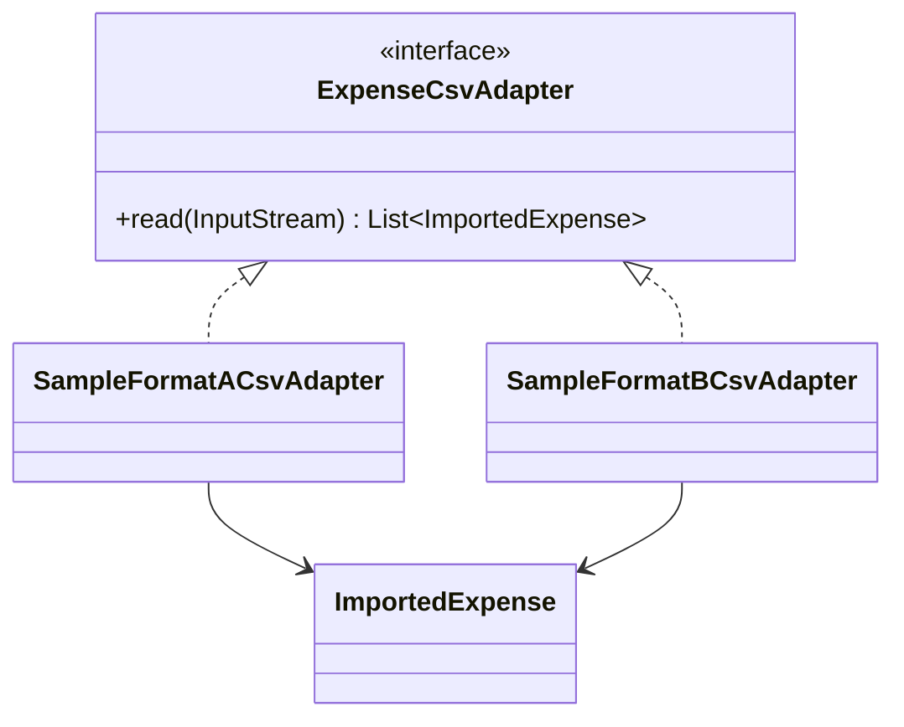
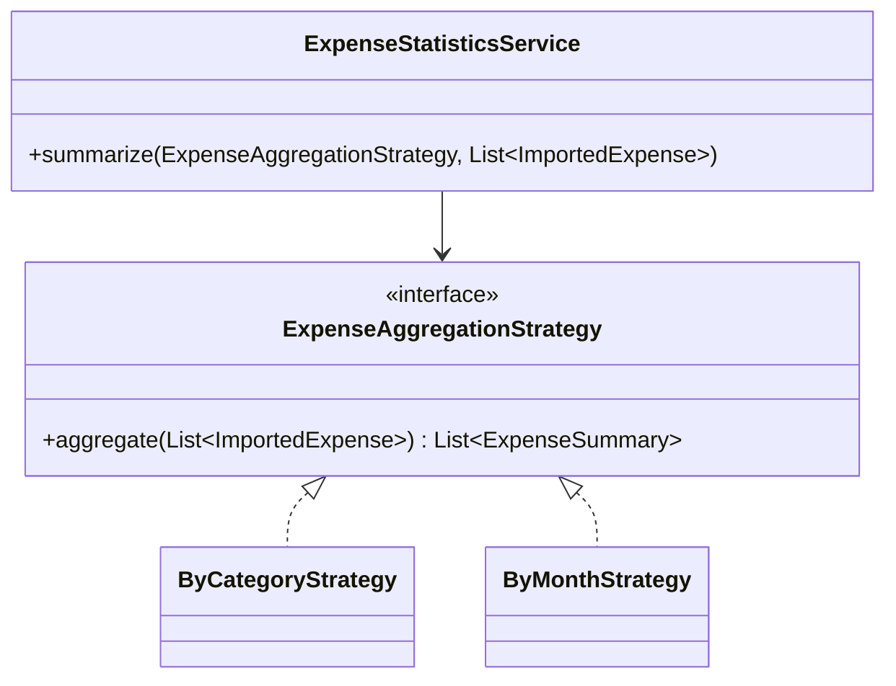

# Ba GoF patterns trong ví nội bộ

Tài liệu này ghi rõ vị trí triển khai dự kiến. Mốc 2 đã có server chuyển tiền; các lớp pattern sẽ được hiện thực cùng sao kê và thống kê ở mốc 3, tránh lớp minh họa không có luồng người dùng.

## 1. Factory Method — xuất sao kê

**Định nghĩa:** Creator khai báo factory method trả Product; Concrete Creator quyết định Concrete Product cụ thể. Logic gọi xuất nằm ở Creator, không chứa nhánh định dạng trong từng màn hình.

**Vì sao cần:** CSV và PDF có xử lý định dạng/tài nguyên khác nhau, nhưng cùng dữ liệu sao kê và quy trình kiểm tra quyền, lọc ngày, tạo tệp. UI chọn CSV/PDF; API chọn `CsvStatementCreator`/`PdfStatementCreator`; `export()` gọi `createExporter()` rồi `write()`. **Hỏi đáp:** “Factory Method khác simple factory?” — quyết định tạo Product được đẩy xuống hai lớp Creator kế thừa, còn quy trình xuất chung nằm ở Creator.

## 2. Adapter — nhập CSV chi tiêu

**Định nghĩa:** Adapter chuyển giao diện nguồn không tương thích thành giao diện đích mà phần nghiệp vụ mong đợi.

**Định dạng mẫu A:** `date,description,category,amount_vnd` (ngày `yyyy-MM-dd`, số tiền nguyên; xem `samples/expenses-a.csv`). **Định dạng mẫu B:** `Ngày GD;Nội dung;Nhóm;Số tiền` (ngày `dd/MM/yyyy`, số tiền dùng dấu chấm phân nhóm; xem `samples/expenses-b.csv`). Đây là hai cấu trúc tự tạo để demo, không gắn với ngân hàng thực tế. Hai adapter parse và xác thực rồi trả `ImportedExpense(spentOn, description, category, amountDong)`. **Vì sao cần:** thống kê không phải hiểu tên cột và cách viết số của từng nguồn. UI nhập CSV → chọn định dạng → xem số dòng/lỗi → lưu dữ liệu nhập. **Hỏi đáp:** “Adapter có làm đổi số dư?” — không; mô hình nhập lưu riêng, không đi qua service chuyển tiền.

## 3. Strategy — tổng hợp thống kê

**Định nghĩa:** đóng gói các thuật toán có cùng giao diện để chọn cách xử lý khi chạy.

**Vì sao cần:** tổng hợp theo danh mục và theo tháng là hai thuật toán nhóm khác nhau trên cùng dữ liệu chuẩn. UI chọn “Danh mục”/“Tháng”; service dùng Strategy tương ứng, trả tổng VND và số giao dịch. **Hỏi đáp:** “Đổi Strategy lúc nào?” — theo lựa chọn bộ lọc thống kê của người dùng, không phụ thuộc định dạng CSV đã nhập.
