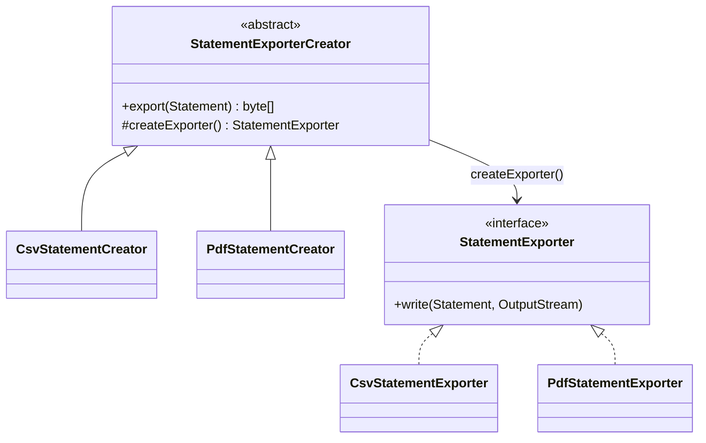
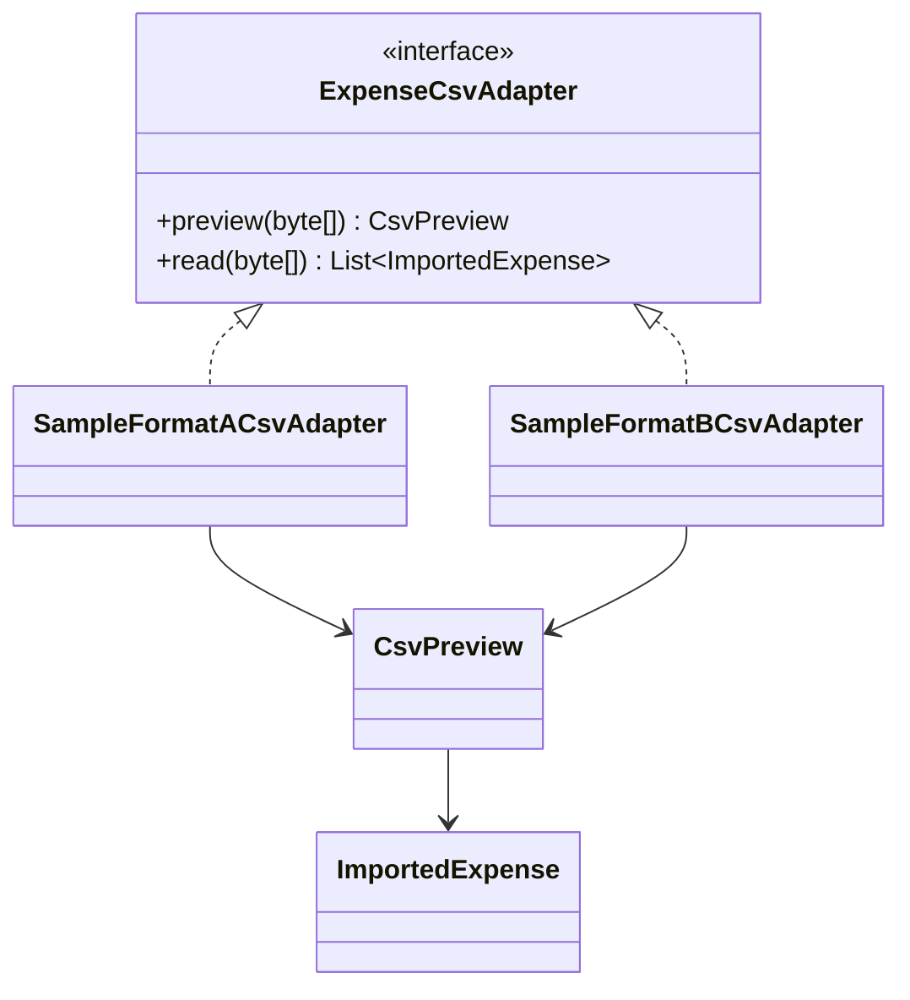
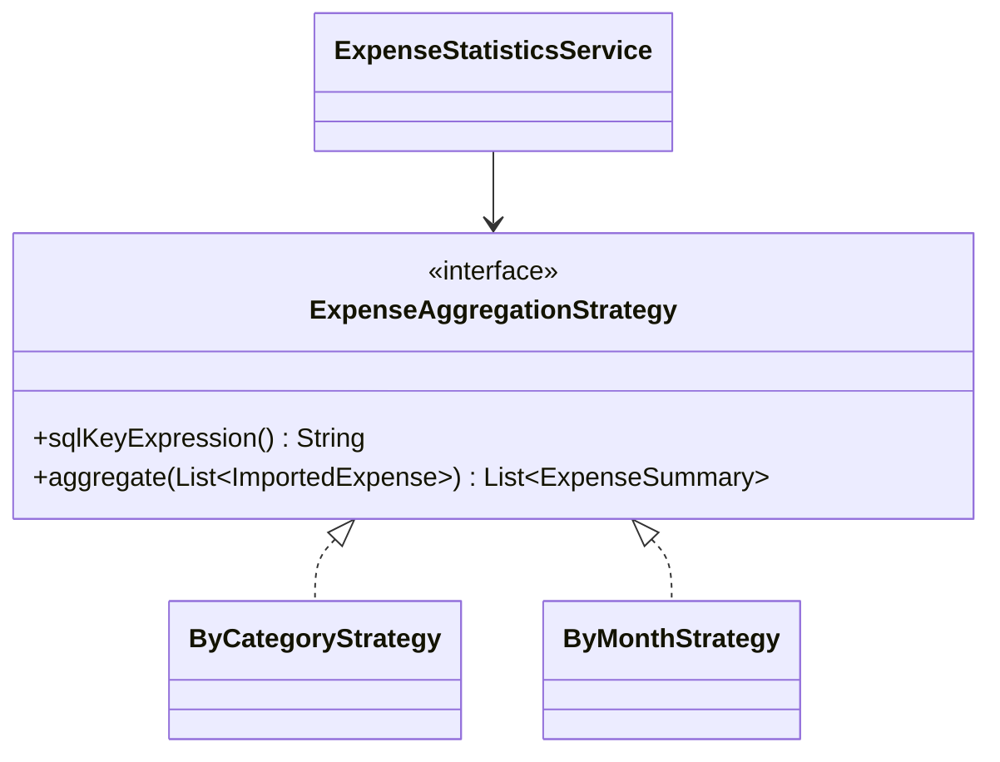

# Ba GoF patterns trong ví nội bộ

Ba pattern dưới đây nằm trong các API đang chạy ở mốc 3. Tất cả endpoint dùng `AuthInterceptor`; service chỉ đọc/ghi dữ liệu thuộc `principal.userId()`.

## 1. Factory Method — xuất sao kê

**Định nghĩa:** Creator khai báo factory method trả Product; Concrete Creator quyết định Concrete Product cụ thể. Logic gọi xuất nằm ở Creator, không chứa nhánh định dạng trong từng màn hình.

**Luồng demo:** `GET /api/v1/statements?from=2026-01-01&to=2026-12-31&format=csv` (hoặc `pdf`) → `StatementController.export()` → `StatementService.export()` truy vấn chuyển tiền của ví hiện tại → chọn `CsvStatementCreator`/`PdfStatementCreator` → quy trình chung `StatementExporterCreator.export()` gọi factory method `createExporter()` → `CsvStatementExporter.write()`/`PdfStatementExporter.write()`. Product nhận cùng `Statement`, kết quả là tệp CSV UTF-8 hoặc PDF có font Unicode. Chỉ số dư sau của ví đăng nhập được đưa vào tệp.

**Vì sao cần:** Hai định dạng có cách ghi khác nhau nhưng dùng cùng quá trình tạo tệp và dữ liệu sao kê. **Hỏi đáp:** “Factory Method khác simple factory?” — mỗi Concrete Creator ghi đè factory method; quy trình `export()` ở Creator không phải `switch` tạo Product. `StatementService` chọn Creator theo tham số API, còn Creator tạo Product.

## 2. Adapter — nhập CSV chi tiêu

**Định nghĩa:** Adapter chuyển giao diện nguồn không tương thích thành giao diện đích mà phần nghiệp vụ mong đợi.

**Định dạng mẫu A:** `date,description,category,amount_vnd` (ngày `yyyy-MM-dd`, số tiền nguyên hoặc `.00`; xem `samples/expenses-a.csv`). **Định dạng mẫu B:** tệp CSV tiếng Việt mới dùng `Ngày,Nội dung,Danh mục,Số tiền` và dấu phẩy (xem [tệp mẫu chuẩn](../samples/chi-tieu-mau.csv)); Adapter B cũng đọc tệp cũ có `Ngày GD;Nội dung;Nhóm;Số tiền` và dấu chấm phẩy (xem `samples/expenses-b.csv`). Đây là các cấu trúc tự tạo để demo, không gắn với ngân hàng thực tế. Giao diện web chỉ hiển thị tệp mẫu chuẩn; định dạng A còn ở API để đọc tệp cũ và minh họa Adapter.

**Luồng demo:** `POST /api/v1/expense-imports/preview?format=SAMPLE_A|SAMPLE_B` → Adapter tương ứng → `ExpenseCsvParsing.preview()` → dòng hợp lệ và lỗi theo dòng, chưa ghi database. Sau khi người dùng xác nhận, `POST /api/v1/expense-imports?format=...` với cùng tệp và `requestKey` → `ExpenseImportService.importFile()` → Adapter `read()` dùng cùng bộ phân tích → `import_batches` và `imported_expenses`. Dedupe theo người dùng + UUID hoặc hash nội dung. **Vì sao cần:** phần lưu và thống kê chỉ hiểu một mô hình dữ liệu, không cần biết tên cột và cú pháp từng CSV. **Hỏi đáp:** “Adapter có làm đổi số dư?” — không; service chỉ ghi bảng nhập, không cập nhật `wallets` hoặc `ledger_entries`.

## 3. Strategy — tổng hợp thống kê

**Định nghĩa:** đóng gói các thuật toán có cùng giao diện để chọn cách xử lý khi chạy.

**Luồng demo:** `GET /api/v1/expense-stats?from=2026-01-01&to=2026-12-31&groupBy=category` (hoặc `month`) → `ExpenseStatsController.view()` → `ExpenseStatisticsService.stats()` chọn `ByCategoryStrategy`/`ByMonthStrategy` → Strategy cung cấp biểu thức nhóm SQL cố định → PostgreSQL tính `SUM/COUNT` → Java sắp xếp key theo cùng thứ tự Unicode như trước. `aggregate()` giữ phép nhóm trong bộ nhớ làm tham chiếu kiểm thử tương đương. **Vì sao cần:** hai cách nhóm có thể thay thế qua giao diện; database chỉ trả các nhóm, không truyền mọi dòng chi tiêu về API. **Hỏi đáp:** “Đổi Strategy lúc nào?” — theo `groupBy` của request; kết quả không phụ thuộc định dạng CSV nguồn.
